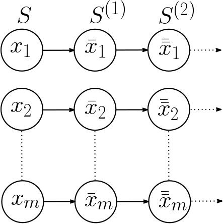
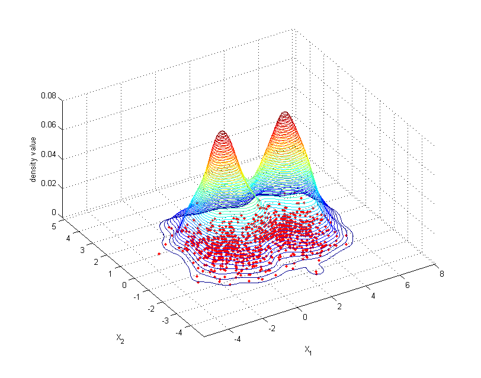

# Imbalance classification problem
Let:

  * $S=\{(x_1, y_1), \ldots (x_m, y_m)\}$ be our training data for a classification problem, where $y_i \in \{0,1\}$ will be our data labels. Therefore, we will have a binary classification problem.
  * $S^{+} = \{(x,y) \in S: y=1\}$ be the positive or minority instances.
  * $S^{-} = \{(x,y) \in S: y=-1\}$ be the negative or majority instances.

If $|S^{+}| > |S^{-}|$, the performance of classification algorithms is highly hindered, especially when it comes to the positive class. Therefore, methods to improve that performance are required. 

Namely, `imbalance` package provides *oversampling* algorithms. Those family of procedures aim to generate a set $E$ of synthetic positive instances based on the training ones, so that we have a new classification problem with $\bar{S}^{+} = S^{+} \cup E$, $\bar{S}^{-} = S^{-}$ and $\bar{S} = \bar{S}^{+}\cup \bar{S}^{-}$ our new training set.

# Contents of the package

In the package, we have the following *oversampling* functions available:

* `mwmote`
* `racog`
* `wracog`
* `rwo`
* `pdfos`

Each of these functions can be applied to a binary dataset (that is, a set of data where labels $y$ could only take two possible values). In particular, the following examples will use datasets included in the package, which are imbalanced datasets. For example, we can run `pdfos` algorithm on `newthyroid1` dataset.

First of all we could check the shape of the dataset:
```{r}
library("imbalance")
data(newthyroid1)

head(newthyroid1)
```

Clearly, `Class` is the class attribute of the dataset and there are two possible classes: `positive` and `negative`. How many instances do we need to balance the dataset? We could easily compute this by doing:


```{r, results=FALSE}
numPositive <- length(which(newthyroid1$Class == "positive"))
numNegative <- length(which(newthyroid1$Class == "negative"))
nInstances <-  numNegative - numPositive
```

We get that we need to generate `r nInstances` instances to balance the dataset. It would not be advisable such a high number of instances, due to the scarcity of minority examples required to infer data structure. We could try to generate 80 synthetic examples instead:


```{r example-pdfos, fig.width = 10, fig.height = 10}
newSamples <- pdfos(dataset = newthyroid1, numInstances = 80, 
                    classAttr = "Class")
```

`newSamples` would contain the 80 synthetic examples, with same shape as the original dataset `newthyroid1`.

All of the algorithms can be used with the minimal parameters `dataset`, `numInstances` and `classAttr`, except for `wRACOG`, which does not have a `numInstances` parameter. The latter adjusts this number itself, and needs two datasets (more accurately, two partitions of the same dataset), `train` and `validation` to work. 

The package also includes a method to plot a visual comparison between the oversampled dataset and the old
imbalanced dataset:

```{r example-plot, fig.width = 10, fig.height = 10}
# Bind a balanced dataset
newDataset <- rbind(newthyroid1, newSamples)
# Plot a visual comparison between new and old dataset
plotComparison(newthyroid1, newDataset, 
               attrs = names(newthyroid1)[1:3], classAttr = "Class")
```

There is also a filtering algorithm available, `neater`, to cleanse synthetic instances. This algorithm could be used with every oversampling method, either included in this package or in another one:


```{r example-neater, fig.width = 10, fig.height = 10}
filteredSamples <- neater(newthyroid1, newSamples, iterations = 500)
filteredNewDataset <- rbind(newthyroid1, filteredSamples)
plotComparison(newthyroid1, filteredNewDataset, 
               attrs = names(newthyroid1)[1:3])
```

# Oversampling
## MWMOTE @Barua_2014
SMOTE is a classic algorithm which generates new examples by filling empty areas among the positive instances. It updates the training set iteratively, by performing:

\[
  E:=E\cup\{x + r(y-x)\}, \quad x,y\in S^{+}, r\sim N(0,1)
\]

It has a major setback though: it does not detect noisy instances. Therefore it can generate synthetic examples out of noisy ones or even between two minority classes, which if not cleansed up, may end up becoming noise inside a majority class cluster.

```{r, out.width="60%", fig.align='center', fig.cap='SMOTE generating noise', echo=FALSE, fig.pos="h"}
knitr::include_graphics("smote-flaws.png")
```

MWMOTE (*Majority Weighted Minority Oversampling Technique*) tries to overcome both problems. It intends to give higher weight to borderline instances, undersize minority cluster instances and examples near the borderline of the two clases. 

Let us recall the header of the method:

```
mwmote(dataset, numInstances, kNoisy, kMajority, kMinority,
       threshold, cmax, cclustering, classAttr)
```

A KNN algorithm will be used, where we call $d(x,y)$ the euclidean distance between $x$ and $y$. Let $NN^{k}(x)\subseteq S$ be the $k$-neighbourhood of $x$ among the whole trainning set (the $k$ closest instances with euclidean distance). Let $NN_{+}^k(x) \subseteq S^{+}$ be its $k$ minority neighbourhood and $NN_{-}^k(x) \subseteq S^{-}$ be its $k$ majority neighbourhood.

For ease of notation, we will name $k_1:=$`KNoisy`, $k_2:=$`KMajority`, $k_3:=$`KMinority`, $\alpha:=$`threshold`, $C:=$`clust`, $C_{clust}:=$`cclustering`.

We define $I_{\alpha,C}(x,y) = C_f(x,y) \cdot D_f(x,y)$, where if $x \notin NN_{+}^{k_3}(y)$ then $I_{\alpha,C}w(x,y) = 0$. 
Otherwise:
\[
  f(x) = \left\{\begin{array}{ll} 
                x &, x\le \alpha \\
                C & \textrm{otherwise}
               \end{array}\right.,\qquad C_f(x,y) = \frac{C}{\alpha} \cdot f\left(\frac{d}{d(x,y)}\right)
\]

$C_f$ measures the closeness to $y$, that is, it will measure the proximity of borderline instances.

$D_f(x,y) = \frac{C_f(x,y)}{\sum_{z\in V} C_f(z,y)}$ will represent a density factor so an instance belonging 
to a compact cluster will have higher $\sum C_f(z,y)$ than another one belonging to a more sparse one.

Let $T_{clust}:= C_{clust} \cdot \frac{1}{|S_f^{+}|} \sum_{x\in S_f^{+}} \underset{y\in S_f^{+}, y\neq x}{min} d(x,y)$. We will also use a mean-average agglomerative hierarchical clustering of the minority instances with threshold $T_{clust}$, that is, we will use a mean distance:
\[dist(L_i, L_j) = \frac{1}{|L_i||L_j|} \sum_{x\in L_i} \sum_{y\in L_j} d(x,y)\]
and having started with a cluster per instance, we will proceed by joining nearest clusters until minimum of distances is lower than $T_{clust}$.  

A general outline of the algorithm is:

* Firstly, MWMOTE computes a set of filtered positive instances: $S_f^{+}$, by erasing those instances whose $k_1$-neighborhood does not contain any positive instance.
* Secondly, it computes the positive boundary of $S_f^{+}$, that is, $U = \cup_{x \in S^{+}_f} NN_{-}^{k_2}(x)$ and the negative boundary, by doing $V = \cup_{x \in U} NN_{+}^{k_3}(x)$.
* For each $x\in V$, it figures out probability of picking $x$ by assigning: $P(x) = \sum_{y\in U} I_{\alpha, C}(x,y)$ and normalizing those probabilities.
* Then, it estimates $L_1, \ldots, L_M$ clusters of $S^{+}$, with the aforementioned jerarquical agglomerative clustering algorithm and threshold $T_{clust}$.
* Generate `numInstances` examples by iteratively picking $x\in V$ with respect to probability $P(x)$, and updating $E:=E\cup \{x+r(y-x)\}$, where $y\in L_k$ is uniformly picked and $L_k$ is the cluster containing $x$.


A few interesting considerations:

* Low $k_2$ is required in order to ensure we do not pick too many negative instances in $U$.
* For an opposite reason, a high $k_3$ must be selected to ensure we pick as many positive hard-to-learn borderline examples as we can.
* The higher the $C_{clust}$ parameter, the less and more-populated clusters we will get.

## RACOG and wRACOG @Das_2015
These set of algorithms assume we want to approximate a discrete distribution $P(W_1, \ldots, W_d)$.

Computing that distribution can be too expensive, because we have to compute:
\[
  |\{\textrm{Feasible values for }W_1\}| \cdots |\{\textrm{Feasible values for} W_d\}|
\]
total values.

We are going to approximate $P(W_1, \ldots, W_d)$ as $\prod_{i=1}^d P(W_i \mid W_{n(i)})$ where $n(i) \in \{1, \ldots, d\}$. Chow-Liu's algorithm will be used to meet that purpose. This algorithm minimizes Kullback-Leibler distance between two distributions:
\[
  D_{KL}(P \parallel Q) = \sum_{i} P(i) \left(\log P(i) - \log Q(i)\right)
\]

We recall the definition for the mutual information of two random discrete variables $W_i, W_j$:
\[
  I(W_i, W_j) = \sum_{w_1\in W_1} \sum_{w_2\in W_2} p(w_1, w_2) \log\left(\frac{p(w_1,w_2)}{p(w_1) p(w_2)}\right)
\]

Let $S^{+}=\{x_i = (w_1^{(i)}, \ldots, w_d^{(i)})\}_{i=1}^m$ be the unlabeled positive instances. The algorithm to approximate the distribution that will be used is:

* Compute $G'=(E',V')$, Chow Liu's dependence tree.
* If $r$ is the root of the tree, we will define $P(W_r|n(r)):=P(W_r)$.
* For each $(u,v) \in E$ arc in the tree, $n(v):=u$ and compute $P(W_v | W_{n(v)})$.

A Gibbs Sampling scheme would later be used to extract samples with respect to the approximated probability distribution, where a badge of new instances is obtained by performing:

* Given a minority sample $x_k = (w_1^{(i)}, \ldots w_d^{(i)})$.
* Iteratively construct for each attribute \[\bar{w}_k^{(i)} \sim P(W_k \mid \bar{w}_1^{(i)}, \ldots, \bar{w}_{k-1}^{(i)}, w_{k+1}^{(i)} \ldots, w_{d}^{(i)})\].
* Return $S = \{\bar{x}_i=(\bar{w}_1^{(i)}, \ldots \bar{w}_d^{(i)})\}_{i=1}^m$.

```{r, out.width="50%", fig.align='center', fig.cap='Markov chain generated by Gibbs Sampler', echo=FALSE, fig.pos="h"}

```

Let us recall the headers of `racog` and `wracog` functions:

```
racog(dataset, numInstances, burnin, lag, classAttr)
```
```
wracog(train, validation, wrapper, slideWin, 
       threshold, classAttr, ...)
```


### RACOG
RACOG (*Rapidly Converging Gibbs*) iteratively builds badges of synthetic instances using minority given ones. But it rules out first `burnin` generated badges and from that moment onwards, it picks a badge of newly-generated examples each `lag` iterations.

### wRACOG
The downside of RACOG is that it clearly depends on `burnin`, `lag` and the requested number of instances `numInstances`. wRACOG (*wrapper-based RACOG*) tries to overcome that problem. Let `wrapper` be a classifier, that could be declared as it follows:

```{r, results=FALSE}
myWrapper <- structure(list(), class = "C50Wrapper")
trainWrapper.C50Wrapper <- function(wrapper, train, trainClass){
  C50::C5.0(train, trainClass)
}
```


That is, a `wrapper` should be an `S3` class with a method `trainWrapper` following the generic method:
```
trainWrapper(wrapper, train, trainClass, ...)
```

Furthermore, the result of `trainWrapper` must be a `predict` callable S3 class.

Another example of `wrapper` with a knn (which can get a little tricky, since it is a lazy classificator):
```{r, results=FALSE}
library("FNN")
myWrapper <- structure(list(), class = "KNNWrapper")

predict.KNN <- function(model, test){
  FNN::knn(model$train, test, model$trainClass)
}

trainWrapper.KNNWrapper <- function(wrapper, train, trainClass){
  myKNN <- structure(list(), class = "KNN")
  myKNN$train <- train
  myKNN$trainClass <- trainClass
  myKNN
}
```

where `train` is the unlabeled tranining dataset, and `trainClass` are the labels for the training set.

An example of call for this dataset may consist in splitting `haberman` dataset (provided by the package) into train and validation, and calling wracog with both partitions and any of the aforementioned wrappers:

```{r, wracog-example}
data(haberman)

trainFold <- sample(1:nrow(haberman), nrow(haberman)/2, FALSE)
newSamples <- wracog(haberman[trainFold, ], haberman[-trainFold, ],
                     myWrapper, classAttr = "Class")
head(newSamples)
```

## RWO @Zhang_2014
RWO (*Random Walk Oversampling*) generates synthetic instances so that mean and deviation of numerical attributes remain as close as possible to the original ones. This algorithm is motivated by the central limit theorem.

### Central limit theorem
Let $W_1, \ldots, W_m$ be a collection of independent and identically distributed random variables, with $\mathbb{E}(W_i) = \mu$ and
$Var(W_i) = \sigma^2 < \infty$. Hence: 
 \[
   \lim_{m} P\left[\frac{\sqrt{m}}{\sigma} \left(\underbrace{\frac{1}{m}\sum_{i=1}^m W_i}_{\overline{W}} - 
   \mu \right) \le z \right] = \phi(z)
 \]
 
where $\phi$ is the distribution function of $N(0,1)$.
 
That is, $\frac{\overline{W} - \mu}{\sigma/\sqrt{m}} \rightarrow N(0,1)$ probability-wise.

Let $S^{+}= \{x_i = (w_1^{(i)}, \ldots w_d^{(i)})\}_{i=1}^m$ be the minority instances. Now, let's fix some $j\in \{1, \ldots d\}$, and let's assume that $j$-ith column follows a numerical random variable $W_j$, with mean $\mu_j$ and standard deviation $\sigma_j < \infty$. Let's compute $\sigma_j' = \sqrt{\frac{1}{m}\sum_{i=1}^m \left(w_j^{(i)} - \frac{\sum_{i=1}^m w_j^{(i)}}{m} \right)^2}$ the biased estimator for the standard deviation. It can be proven that instances generated with $\bar{w}_j = w_j^{(i)} - \frac{\sigma_j'}{\sqrt{m}}\cdot r, r\sim N(0,1)$ have the same sample mean as the original ones, and their sample variance tends to the original one.

### Outline of the algorithm
Our algorithm will proceed as follows:

* For each numerical attribute $j=1, \ldots, d$ compute the standard deviation of the column, $\sigma_j' = \sqrt{\frac{1}{m}\sum_{i=1}^m \left(w_j^{(i)} - \frac{\sum_{i=1}^m w_j^{(i)}}{m} \right)^2}$.
* For a given instance $x_i=(w_1^{(i)}, \ldots, w_d^{(i)})$, for each attribute attribute $j$, generate:

\[
\bar{w}_j = \left\{\begin{array}{ll}
w_j^{(i)} - \frac{\sigma_j'}{\sqrt{m}}\cdot r, r\sim N(0,1) & \textrm{if numerical attribute}\\
\textrm{pick uniformly over } \{w_j^{(1)}, \ldots w_j^{(m)}\} & \textrm{otherwise}
\end{array}\right.
\]

## PDFOS [-@Gao_2014]
### Motivation
Given a distribution function of a random variable $X$, namely $F(x)$, if that function has an almost everywhere derivative, then, almost everywhere, it holds:
\[
  f(x) = \lim_{h\rightarrow 0} \frac{F(x+h) - F(x-h)}{2h} = \lim_{h\rightarrow 0} \frac{P(x-h < X \le x+h)}{2h}
\]

Given random samples of $X$, $X_1, \ldots X_n$, namely $x_1, \ldots x_n$, an estimator for $f$ could be the mean of samples in $]x-h, x+h[$ divided by the length of the interval:
\[
  \widehat{f}(x) = \frac{1}{2hn} \bigg[\textrm{Number of samples } x_1, \ldots, x_n \textrm{ that belong to ]x-h, x+h[}\bigg]
\]

If we define $\omega(x) = \left\{\begin{array}{ll} 
                                \frac{1}{2} &, |x| < 1\\
                                0 & \textrm{otherwise}
                                \end{array}\right.$
                                
                                
and $w_h(x) = w\left(\left|\frac{x}{h}\right|\right)$, then we could write $\widehat{f}$ as:
\[
  \widehat{f}(x) = \frac{1}{nh} \sum_{i=1}^n \omega_h(x-x_i)
\]

It we assume that $x_1, \ldots, x_n$ are equidistant with distance $2h$ (they are placed in the middle of $2h$ length intervals), $\widehat{f}$ could be seen as an histogram where each bar has a $2h$ width and a 
$\frac{1}{2nh} \cdot \bigg[[\textrm{Number of samples } x_1, \ldots, x_n \textrm{ that belong to the interval}]\bigg]$ length. Parameter $h$
is called *bandwidth*.

In multivariate case ($d$ dimensional), we define:
\[
  \widehat{f}(x) = \frac{1}{nh^d} \sum_{i=1}^n \omega_h(x-x_i)
\]

### Kernel methods
If we took $w = \frac{1}{2} \Large{1}\normalsize_{]-1,1[}$, then $\widehat{f}$ would have jump discontinuities and we would have jump derivatives. On the other hand, we could took $\omega$, where $w\ge 0$, $\int_{\Omega} \omega(x) dx = 1$, $\Omega \subseteq X$ a domain, and $w$ were even, and that way we could have estimators with more desirable properties with respect to continuity and differentiability.

$\widehat{f}$ can be evaluated through its MISE (*Mean Integral Squared Error*):
\[
  MISE(h) = \underset{x_1, \ldots, x_d}{\mathbb{E}} \int (\widehat{f}(x) - f(x))^2 dx
\]

```{r, out.width="75%", fig.align='center', fig.cap='Example of kernel estimation', echo=FALSE, fig.pos="h"}

```

#### Gaussian kernels
PDFOS (*Probability Distribution density Function estimation based Oversampling*) uses multivariate Gaussian kernel methods. The probability density function of a $d$-Gaussian distribution 
with mean $0$ and $\Psi$ as its covariance matrix is:
\[
  \phi^{\Psi}(x) = \frac{1}{\sqrt{(2\pi \cdot det(\Psi))^d}} exp\left(-\frac{1}{2} x \Psi^{-1} x^T \right)
\]

Let $S^{+} = \{x_i = (w_1^{(i)}, \ldots, w_d^{(i)})\}_{i=1}^m$ be the minority instances. The unbiased covariance estimator is:
\[
  U = \frac{1}{m-1} \sum_{i=1}^m (x_i - \overline{x})(x_i - \overline{x})^T, 
  \qquad \textrm{where } \overline{x} = \frac{1}{m}\sum_{i=1}^m x_i
\]
  
We will use kernel functions $\phi_h(x) = \phi^U\left(\frac{x}{h}\right)$, where $h$ ought to be optimized to minimize the MISE. It is well-known that can be achieved by minimizing the following cross validation function:
\[
 M(h) = \frac{1}{m^2 h^d} \sum_{i=1}^m \sum_{j=1}^m \phi_h^{\ast} (x_i - x_j) + \frac{2}{m h^d} \phi_h(0)
\]
where $\phi_h^{\ast} \approx \phi_{h\sqrt{2}} - 2\phi_h$.

Once a proper $h$ has been found, a suitable generating scheme could be to take $x_i + h R r$, where $x_i \in S^{+}$, $r\sim N^d(0,1)$ and $U = R\cdot R^T$. In case we have enough guarantees to decompose $U = R^T \cdot R$ ($U$ must be a positive-definite matrix), we could use Choleski decomposition. In fact, we provide a sketch of proof showing that all covariance matrices are positive-semidefinite:
\[
y^T \left(\sum_{i=1}^m (x_i - \overline{x})(x_i - \overline{x})^T\right) y = \sum_{i=1}^m (\underbrace{(x_i - \overline{x})^T y}_{z_i^T})^T \underbrace{(x_i - \overline{x})^T y}_{z_i}) = \sum_{i=1}^m ||z_i||^2\ge 0
\]
for arbitrary $y \in \mathbb{R}^d$. We need a strict positive definite matrix, otherwise PDFOS would not provide a result and will stop its execution.

### Search of optimal bandwidth
We take a first approximation to $h$ as the value:
\[
  h_{Silverman} = \left(\frac{4}{m(d+2)}\right)^{\frac{1}{d+4}}
\]
where $d$ is number of attributes and $m$ the size of the minority class.

Reshaping the equation of the cross validation function and differentiating:
\begin{align}
M(h) &= \frac{1}{m^2 h^d} \sum_{i=1}^m \sum_{j=1}^m \phi_h^{\ast} (x_i - x_j) + \frac{2}{m h^d} \phi_h(0) \nonumber\\
     &= \frac{1}{m^2 h^d} \sum_{i=1}^m \sum_{j=1, j\neq i}^m \phi_h^{\ast} (x_i - x_j) + \frac{1}{m h^{d}} \phi_{h\sqrt{2}}(0) \nonumber\\
     &= \frac{2}{m^2 h^d} \sum_{j > i}^m \phi_h^{\ast} (x_i - x_j) + \frac{1}{m h^{d}} \phi_{h\sqrt{2}}(0)
 \label{eq:cv-simp}
\end{align}

\begin{align}
\frac{\partial M}{\partial h}(h) &= \frac{2}{m^2 h^d} \sum_{j>i}^m  \phi_h^{\ast} (x_i - x_j)
 \bigg(-d h^{-1} + h^{-3} (x_i-x_j)^T U (x_i-x_j) \bigg) \nonumber
 - \frac{dh^{-1}}{mh^{d}} \phi_{h\sqrt{2}}(0)
 \label{eq:cross-val-df}
\end{align}

And a straightforward *gradient descendent* algorithm is used to find a good $h$ estimation.

# Filtering
Once we have created synthetic examples, we should ask ourselves how many of those instances are in fact relevant to our problem. Filtering algorithms can be applied to *oversampled* datasets, to erase the least relevant instances.

## NEATER @Almogahed_2014
NEATER (*filteriNg of ovErsampled dAta using non cooperaTive gamE theoRy*) is a filtering algorithm based on game theory.

### Introduction to Game Theory
Let $(P, T, f)$ be our game space. We would have a set of players, $P=\{1, \ldots, n\}$, and $T_i=\{1, \ldots, k_i\}$, set of feasible strategies for the $i$-th player, resulting in $T = T_1 \times \ldots \times T_n$. We can easily assign a payoff to each player taking into account his/her own strategy as well as other players' strategy. So $f$ will be given by the following equation:
\[
  \begin{array}{rll}
  f: T &\longrightarrow& \mathbb{R}^n\\
  t &\longmapsto& (f_1(t), \ldots, f_n(t))
 \end{array}
\]
  
$t_{-i}$ will denote $(t_1, \ldots, t_{i-1}, t_{i+1}, \ldots, t_n)$ and similarly we can denote $f_i(t_i, t_{-i})= f_i(t)$.

An *strategic Nash equilibrium* is a tuple $(t_1, \ldots, t_n)$ where $f_i(t_i, t_{-i}) \ge f_i(t'_{i}, t_{-i})$ for every other $t'\in T$, and all $i=1, \ldots, n$. That is, an strategic Nash equilibrium maximizes the payoff for all the players.

The strategy for each player will be picked with respect to a given probability: 
\[
\delta_i \in \Delta_i = \{(\delta_i^{(1)}, \ldots, \delta_i^{(k_i)}) \in (R^{+}_0)^{k_i} : \sum_{j=1}^{k_i} \delta_i^{(j)} = 1\}
\]
We define $\Delta_1 \times \ldots \times \Delta_n := \Delta$ and we call an element $\delta = (\delta_1, \ldots, \delta_n) \in \Delta$ an strategy profile. Having a fixed strategy profile $\delta$, the overall payoff for the $i$-th player is defined as:
\[
  u_i(\delta) = \sum_{(t_1, \ldots, t_n)\in T} \delta_i^{(t_i)} f_i(t)
\]

Given $u_i$ the payoff for a $\delta$ strategy profile in the $i$-th player and $\delta\in \Delta$ we will denote

\begin{align}
\delta_{-i} &:= (\delta_1, \ldots, \delta_{i-1}, \delta_{i+1}, \ldots, \delta_n)\\
u_i(\delta_i, \delta_{-i}) &:= u_i(\delta)
\end{align}

A *probabilistic Nash equilibrium* is a strategy profile $x = (\delta_1, \ldots, \delta_n)$ verifying
$u_i(\delta_i, \delta_{-i}) \ge u_i(\delta'_{i}, \delta_{-i})$ for every other $\delta'\in \Delta$, and all $i=1, \ldots, n$.

A theorem ensures that every game space $(P,T,f)$ with finite players and strategies has a *probabistic Nash equilibrium*

### Particularization to imbalance problem
Let $S$ be the original training set, $E$ the synthetic generated instances. Our players would be $S \cup E$. Every player would be able to pick between two different strategies: $0$ - being a negative instance - and $1$ - being a positive instance -. Players of $S$ would always have a fixed strategy, where the $i$-th player would have $\delta_i = (0,1)$ (a $0$ strategy) in case it is a negative instance or $\delta_i = (1,0)$ (a $1$ strategy) otherwise.

The payoff for a given instance is affected only by its own strategy and its $k$ nearest neighbors in $S\cup E$. That is, for every $x_i \in E$, we will have $u_i(\delta) = \sum_{j\in NN^k(x)} (x_i^T w_{ij} x_j)$ where $w_{ij} = g\left(d(x_i, x_j)\right)$ and $g$ is a decreasing function (the further, the lower payoff). In our implementation, we have considered $g(z) = \frac{1}{1+z^2}$, with $d$ the euclidean distance.

Each step should involve an update to the strategy profiles of instances of $E$. Namely, if $x_i \in E$, the following equation will be used:
\begin{align*}
& \delta_i(0) = \left(\frac{1}{2}, \frac{1}{2}\right)\\
& \delta_{i,1}(n+1) = \frac{\alpha + u_i((1,0))}{\alpha + u_i(\delta(n))} \delta_{i,1}(n)\\
& \delta_{i,2}(n+1) = 1 - \delta_{i,1}(n+1)
\end{align*}

That is, we are reinforcing the strategy that is producing the higher payoff, in detriment to the opposite strategy. This method has enough convergence guarantees.

Let's recall the header for `neater`:
```
neater(dataset, newSamples, k, iterations, smoothFactor, classAttr)
```
Then a rough sketch of the algorithm is:

* Compute `k` nearest neighbors for every instance of $E:=$`newSamples`.
* Initialize strategy profiles of `dataset`$\cup$`newSamples`.
* Iterate `iterations` times updating payoffs with the aforementioned rule and strategy profiles.
* Keep only those examples of `newSamples` with probability of being positive instances higher than $0.5$.

# References
